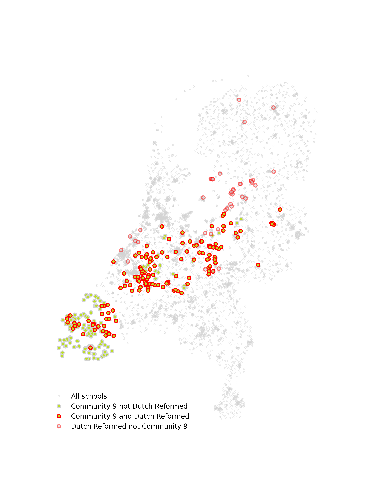

# Schools networks applied to Netherlands - Analysis and measles outbreak simulations 

## Introduction 

Large measles outbreaks still occasionally occur in the Netherlands despite very high MMR uptake - which would be expected to contain outbreaks to a small number of cases. This is largely associated with a two socio-religious groups who refuse vaccination in large numbers - the protestant orthodox church (Rerformatorisch) and the Anthroposophic community. 

The school system in the Netherlands allows for a high degree of structure in terms of faith and philosophical alignment, both of these communities have schools associated with their particular beliefs and values. 

We use data from the Dutch Education Executive (DUO) to construct a network of schcools linked through households. We analyse this network and simulate outbreaks on the network, to evaluate the role of schools in facilitating large national outbreaks within these communities. 

*Fig.* A community in the school network that contains 80% of Reformatorisch schools, displaying how schools connected through households can link unvaccination children on a national scale.